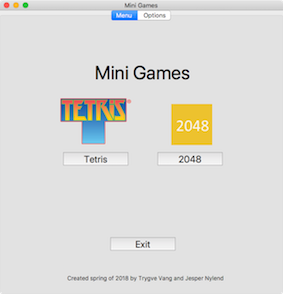
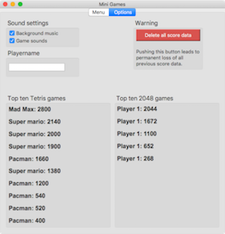
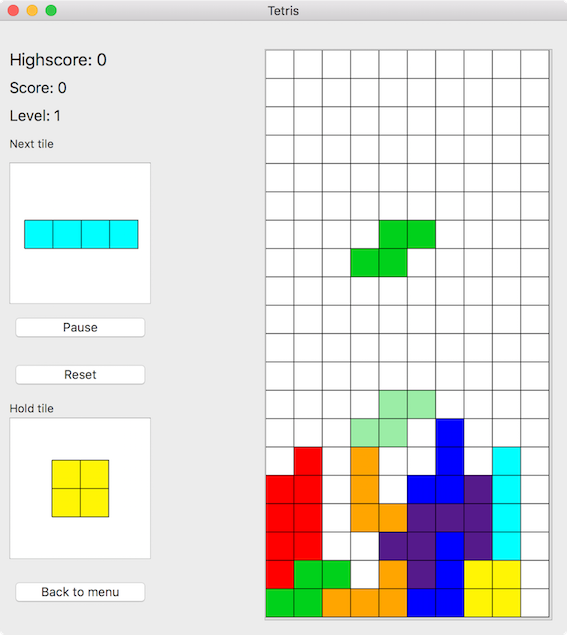
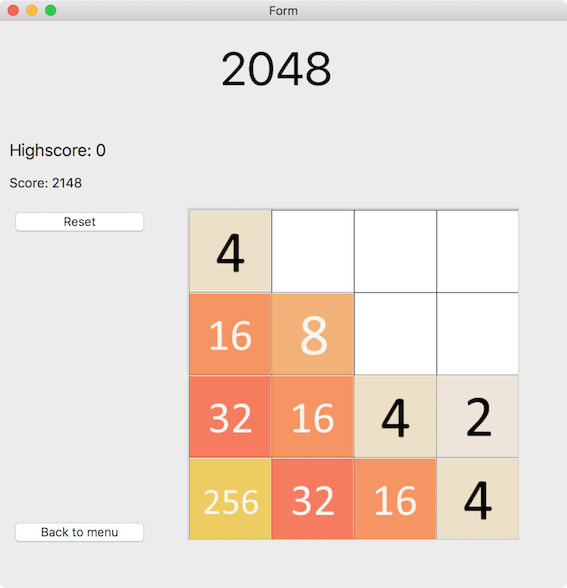

# MiniGames - Project task in the DAVE3605 class at OsloMet
As a part of the DAVE3605 class at OsloMet students were to choose a project to implement in C or C++. This project was inspired by the multi game cartridges that one could get their hands on during the 90’s and 00’s. These cartridges would as the name suggest include more than one game.

MiniGames includes two games; Tetris and 2048

## Main menu and options menu
When starting the application, the main menu is the first thing that is presented to a user. This stage is used to navigate either to Tetris, 2048, the options menu, or exit the application. 

Because both Tetris and 2048 does not require much RAM we decided to instantiate both games when starting the app. This enables the user to quickly go from one game to another, or to the options menu without losing their game data. In other words, one could take a break from one game, play the other game, and later return to the original game without starting all over.

The below figure shows the main menu, with buttons to Tetris, 2048, and exit. As seen there is also tabs for “Menu” and “Options”



The options menu contains both settings and top ten highscores. Through the settings any user can choose whether to play background music or not, play game sounds or not, choose a playername, and delete all previous score data.

The below figure shows the options menu with sound settings, playername, and option to delete all previous score data. The figure also shows top games. If there are less than ten games persisted, all are shown, but when more than ten games are played, only top ten is shown.



## Tetris


### Implementation
We wanted Tetris to be implemented following the principles of object orientation. Therefore we decided to make every entity of it as a class. Our implementation of Tetris contains a game controller, board, abstract tile class, and one class for each of the seven tiles in the game. Every tile piece was a subclass of the abstract tile class.

The implementation uses inheritance and polymorphism. The abstract Tile class is the parent of all seven tile pieces used in the game, and define their common behavior. Polymorphism can be seen in most of the member functions of the board class, and in some of the member functions of the controller. These member functions use a pointer to a Tile, but when playing one would always use a subclass of Tile. This principle is known as widening.

Tetris is a game that easily can be implemented without the use of inheritance. In our case the only thing that differed from the different pieces was their shape, and one of the seven pieces shall not rotate. We still decided to use inheritance to use design pattern in addition to making the code more human readable.

When playing, the user controls the active tile, and can move it horizontally, rotate it, and control how fast it moves vertically. When the tile cannot move further down its shape is set on the gameboard, and the user starts playing the next tile. The tile is not in direct contact with the board before its final vertical position. Instead it “floats” on top of the board, and has a coordinate to keep track of where it is relative to the board.

When setting a tile on the board its “shape” is set on the board. The shape is a matrix made of `vector<vector<int>>`, and the int value represent what type of tile it is. This is done because the different tile pieces have different colors in the GUI, and when deleting a row parts of tile can be deleted.

### Features and rules of the game
The following table shows features in the implementation, and gives a brief description.
| Feature | Description |
| ------- | ––––––––––– |
| Rotate | Rotates the active tile 90 degrees clockwise. |
| Horizontal move | Moves active tile horizontally on the board. |
| Hold tile | Holds active tile. Can hold one tile of a time. If tile is already being held, active tile and held tile switches place. |
| Soft drop | Active tile moves faster down the board. |
| Slam tile | Set active tile to its final vertical position respective to its horizontal position and rotation. |
| Ghost tile | Shows the final vertical position of active tile based on its horizontal position and rotation. |

The goal of the game is to get as high score as possible. Score is increased when a row in the board is full and is deleted. Filling more rows with one tile gives higher score compared to filling one row at a time. Every 10th row that is filled increases the game level by one and therefore makes the active tile move faster vertically.

The game also uses sounds as stated earlier. When activated the game plays a background song, and has a game sound connected to rotating a tile, slamming a tile, deleting a row, and game over sound.

The game is over when a new tile cannot be spawned in its normal starting position.

### Controls
The following table shows the controls of the implementation.
| Key | Feature |
| --- | ------- |
| W/Key up | Rotate active tile |
| A/Key left | Move active tile to the left |
| D/Key right | Move active tile to the right |
| S/Key down | Activate soft drop |
| Spacebar | Slam active tile |
| C | Hold active tile |
| P | Pause the game |

### Standards from The Tetris Company
The Tetris Company is the owner of the concept of the game. However they allow anyone to implement their own version of the game as long as they follow a specific set of guideline. This guideline encourages a standard for all Tetris-implementations. Some of these rules are about how the game mechanics works. For example how long the tetromino (in this document referred to as tile) stays on each row, how fast the timer increases, how to choose next tile. The guidelines also explain that you have to include a logo similar to the original Tetris logo. In this implementation the logo can be seen on the main menu. We did not have the time to implement our version according to all of the guidelines, but we managed to do the most important ones. This includes that tile-choosing will insure the user that they will get a certain piece within the seven next tiles and when starting the game the first tile stays in its initial position for three seconds before falling vertically.

### Remaining issues
There are still a few minor issues with the game. Game over is not drawn to the user if the user hit the spacebar key in the exact moment when game is over. Also if the I-tile is rotated to its vertical position and its x-position is on the right edge of the board, it cannot rotate. In this situation on Macintosh the tile can rotate, but is “cut”. This means that only two out of four elements in the tile is shown. 

## 2048


### Implementation
2048 is implemented with a class for game controller and a class for board. Instead of using an object to represent a tile, an int value represents the value of a certain element. As opposed to Tetris where the int value of an element represent what type of tile piece it is, the value of an element in 2048 is the exact value of said element. Therefore when merging two elements the value of that element is increased.

Another different approach from Tetris was using pictures to represent a tile. Using models like this is widely used in real life game industry, and therefore we wanted a part of our project to do the same.

As explained in the rules subchapter, after making a valid move a new tile is set randomly on the board. Instead of just picking random numbers until making a valid coordinate on the board, our implementation keeps track of available elements, and pick randomly from that list. This is a much more efficient way of choosing the next tile, and does not require any brute force. The next tile can either spawn as the number 2, or the number 4. There is a 10 percent chance of spawning the number 4.

### Rules
The goal of this game is to reach the tile 2048, and get as high score as possible. The score and tile is increased by merging to identical tiles. The user can slide all tiles to the left, right, up and down.

A valid move is when the player slides the tiles in one direction, and at least one tile is merged or is slided. In other words if the tiles cannot slide left because all tiles already are slided left, and there are no tiles to be merged left that is not a valid move. The picture shown at the beginning of this chapter illustrates a case like this. 
The game is over when there are no more available elements to spawn a tile and there are no tiles that could be merged. When this happens the board signals that the game is over and if game sounds are activated, a game over sound will play.

### Controls
The following table shows the controls of the implementation.
| Key | Feature |
| --- | ------- |
| W/Key up | Slides tiles to the top of the board, merging all identical pieces. |
| A/Key left | Slides tiles the the left of the board, merging all identical pieces. |
| S/Key down | Slides tiles to the bottom of the board, merging all identical pieces. |
| D/Key right | Slides tiles to the right of the board, merging all identical pieces. |


## Input/Output
The application persists previous high scores in CSV-documents. Based on a [Wikipedia](https://en.wikipedia.org/wiki/Comma-separated_values) article the document type normally uses comma to separate values (hence the name Comma Separated Values), but can also use characters such as semicolon. Based on that, our program uses semicolon to separate values.

The function writing to file writes the game data to a new file if the app cannot find any file, and appends to a file if it already exist. The function reading from file reads line by line, parses the data separated by semicolon, and pushes it into a list of a struct of type Game. After the document is parsed the list of Games are sorted descending based on a comparator that compare two Games.

This struct links a playername and a score making it easy to show that data in the Options-GUI.

The delete button in the options-menu will delete the documents containing previous score data.

The I/O functions asserts that all data in the CSV documents are correct. In other words if a line in the document to parse says for instance “playername;score;arbitrary data”, that will mess up the parsing. This is not handled due to the fact that to achieve this sort of mess-up, one would have to manually change the highscore documents.

Currently the game does not support that newly aquired highscores are directly shown in the options menu without restarting the game. This is not a bug, nor a weakness in the I/O functions. Rather this is a product of the limited time we had at hand. The appropriate member function is not called when new highscore is done.

## Input validation
When allowing a user to input data through the keyboard, a possible safety hole is opened to the system. As stated in the above subchapter, I/O functions assert that all data is valid. Therefore the application validates any given playername before accepting it. This is done by comparing the given data to this regex: 
```
^[a-zA-Z0-9æøåÆØÅ_-]+[a-z A-Z0-9æøåÆØÅ!_-]*$
```
The regex states that a playername can contain any letter from the norwegian alphabet, underscore, hyphen, space and exclamation point, but cannot begin with any of the two last characters.
If the given string does not match this pattern, playername is set to “Unnamed player”.
